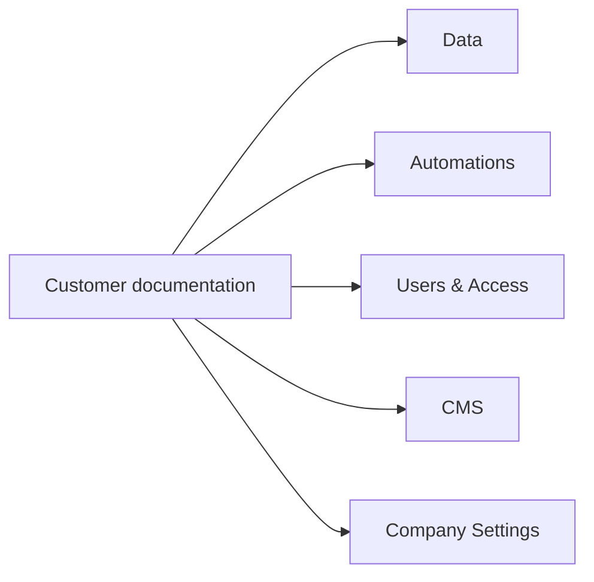

# Changelog

SVG fallback: Documentation restructuring lineage

## 29 July 2026 — Customer documentation structure created

### Added

- `README.md`
- `01 Getting Started.md`
- `02 Objects and Data Model.md`
- `03 Extended Objects.md`
- `04 Relations.md`
- `05 Traits.md`
- `07 Views and Filters.md`
- `08 Automations.md`
- `09 Users and Access.md`
- `10 Practical Examples.md`
- `Glossary.md`
- `Changelog.md`
- inline Mermaid diagrams in every Markdown document;
- editable `.mmd` diagram sources;
- `.svg` diagram fallbacks.

### Technical source moved

- The former Object Model Guide and Technical Specification are retained in the private Caraer concept library for internal reference.
- The customer-facing folder now contains plain-language chapters only.

### Corrected terminology

- retained **Primary Object** and **Extended Object**;
- defined Properties as native data on an Object;
- defined Shared Properties as originating from an Extended Object;
- separated Traits from the data model;
- defined Traits as behavioural aspects of Objects;
- added the `Analytics` Trait;
- clarified that both Primary and Extended Objects can have Traits;
- clarified that Relations connect independent Records.
- merged Activities into `05 Traits.md` under the Activities section;
- grouped Action, Message, Event, and Task under Activities for customer-facing guidance.

### Canonical examples

- `Contact` contains the Records `John Smith` and `Jane Smith`;
- `Customer` and `Reseller` can coexist as extensions of one Contact;
- `Candidate` morphs to `Employee`, then to `Alumni`;
- `Customer` and `Reseller` can both have `Table` and `Page`;
- `Onboarding` can have the `Task` Trait and be assigned to an Employee Record.

### Removed or superseded

- Main/Child terminology;
- the assumption that Shared Properties are owned by the Primary Object;
- old Trait names not present in the current Trait selector;
- examples that combined Objects, Records, Extensions and Traits into one misleading hierarchy;
- the claim that Traits are role records.

## 29 July 2026 — Customer-facing chapters completed

Updated the remaining chapters with plain-language guidance for:

- creating and using Views and Filters;
- creating, testing, and maintaining Automations;
- Users, access responsibilities, and access reviews;
- practical examples combining Objects, Properties, Extended Objects, Relations, Traits, Activities, Views, and Automations;
- the customer-facing glossary.

Activities are documented within `05 Traits.md`. The former standalone `06 Activities.md` chapter was removed from the customer-facing structure.

## 29 July 2026 — Website menu structure

The customer documentation was reorganised into main-menu folders:

- `Data/` for Objects, Extended Objects, Relations, Traits, Activities, Views and Filters, and practical examples;
- `Automations/` for Scenarios and Nodes, based on the official Latenode documentation;
- `Users & Access/` for Users, Teams, Suites, Scopes, and Authorisations;
- `CMS/` for Structure, Components, and Settings;
- `Company Settings/` for company-wide configuration options.

The former Getting Started page was removed. Glossary and Changelog remain reference pages.

## 29 July 2026 — Latenode submenu expansion

The Automations menu was expanded from Scenarios and Nodes into nine customer-facing areas based on the Latenode sitemap:

- Scenarios;
- Nodes;
- Integrations;
- AI Agents;
- Databases;
- MCP Server;
- Account Management;
- Operators;
- Data Flow.
