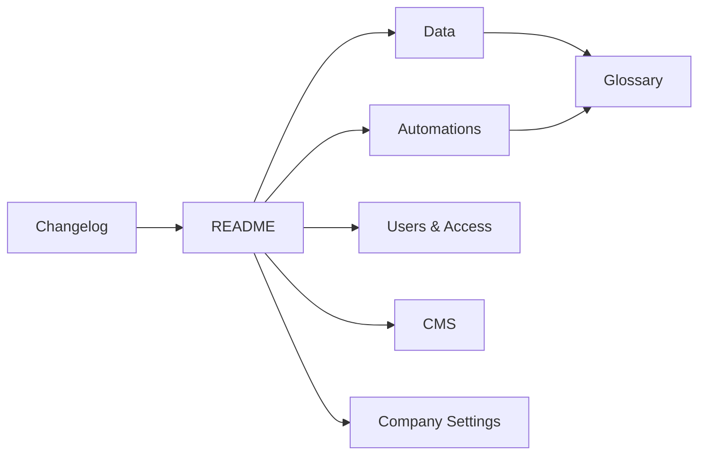

# Diagram Index

Every diagram is available as editable Mermaid (`.mmd`) and rendered SVG (`.svg`).

| Diagram | Mermaid | SVG |
|---|---|---|
| Documentation Map | [documentation-map.mmd](documentation-map.mmd) | [documentation-map.svg](documentation-map.svg) |
| Object Record Properties | [object-record-properties.mmd](object-record-properties.mmd) | [object-record-properties.svg](object-record-properties.svg) |
| Primary Extended Shared Properties | [primary-extended-shared-properties.mmd](primary-extended-shared-properties.mmd) | [primary-extended-shared-properties.svg](primary-extended-shared-properties.svg) |
| Multiple Extensions | [multiple-extensions.mmd](multiple-extensions.mmd) | [multiple-extensions.svg](multiple-extensions.svg) |
| Morphing Lifecycle | [morphing-lifecycle.mmd](morphing-lifecycle.mmd) | [morphing-lifecycle.svg](morphing-lifecycle.svg) |
| Traits | [traits.mmd](traits.mmd) | [traits.svg](traits.svg) |
| Task Behaviour Relation | [task-behaviour-relation.mmd](task-behaviour-relation.mmd) | [task-behaviour-relation.svg](task-behaviour-relation.svg) |
| Relation Vs Extension | [relation-vs-extension.mmd](relation-vs-extension.mmd) | [relation-vs-extension.svg](relation-vs-extension.svg) |
| Modelling Decision Tree | [modelling-decision-tree.mmd](modelling-decision-tree.mmd) | [modelling-decision-tree.svg](modelling-decision-tree.svg) |
| Technical Record Model | [technical-record-model.mmd](technical-record-model.mmd) | [technical-record-model.svg](technical-record-model.svg) |
| Extension Invariants | [extension-invariants.mmd](extension-invariants.mmd) | [extension-invariants.svg](extension-invariants.svg) |
| Trait Application Model | [trait-application-model.mmd](trait-application-model.mmd) | [trait-application-model.svg](trait-application-model.svg) |
| Glossary Concept Map | [glossary-concept-map.mmd](glossary-concept-map.mmd) | [glossary-concept-map.svg](glossary-concept-map.svg) |
| Version Lineage | [version-lineage.mmd](version-lineage.mmd) | [version-lineage.svg](version-lineage.svg) |

## Diagram relationship

SVG fallback: Documentation map

